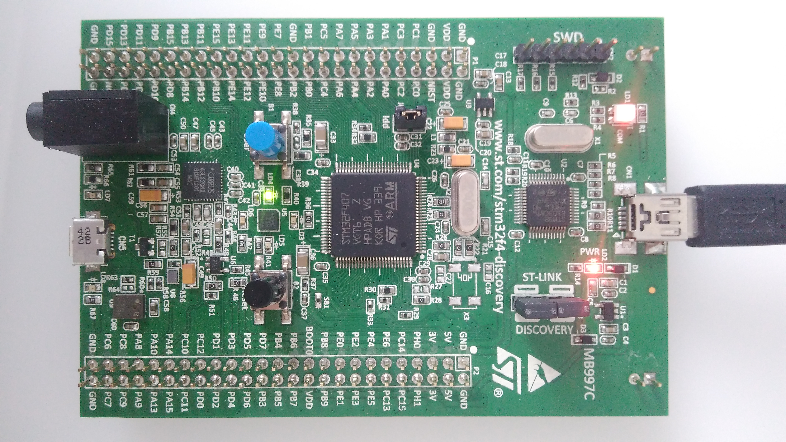

# Project description

A template project with FreeRTOS on STM32F407VGT6 microcontroller. 

  
   A STM32F4Discovery board with blinking green LED 

## How to use

* Clone or fork this repo
* Compile it with favorite IDE (SW4STM in my case)
* Flash the microcontroller

## How it works

The FreeRTOS configuration is in `inc/FreeRTOSConfig.h`.
`configCPU_CLOCK_HZ` is set to 16 MHz (STM is clocked by HSI clock source).

There is a single task: `LedTask` which is called every 100 ms. In this
task the `PIN_LED_GREEN` state is toggled, so the LED is flashing.

## License
The contents of this repository are covered under the [MIT License](./LICENSE.txt)

## Contributing

1. Fork it (<https://github.com/michLab/cortex_m4_freertos_template.git>)
2. Create your feature branch (`git checkout -b feature/fooBar`)
3. Commit your changes (`git commit -am 'Add some fooBar'`)
4. Push to the branch (`git push origin feature/fooBar`)
5. Create a new Pull Request

